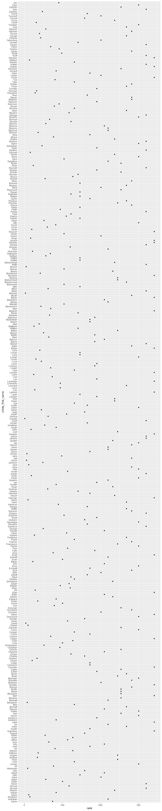

p8105\_hw2\_zl3119
================
Zheyan
2021/9/30

# Problem1

Read and clean the Mr. Trash Wheel sheet:

-   specify the sheet in the Excel file and to omit non-data entries
    (rows with notes / figures; columns containing notes) using
    arguments in read\_excel
-   use reasonable variable names
-   omit rows that do not include dumpster-specific data
-   round the number of sports balls to the nearest integer

Read and clean precipitation data for 2018 and 2019. For each, omit rows
without precipitation data and add a variable for year. Next, combine
precipitation datasets and convert month to a character variable (the
variable month.name is built into R and should be useful).

Write a paragraph about these data; you are encouraged to use inline R.
Be sure to note the number of observations in both resulting datasets,
and give examples of key variables. For available data, what was the
total precipitation in 2018? What was the median number of sports balls
in a dumpster in 2017?

## Read and clean Mr.Trash Wheel Sheet

``` r
TW_df_raw = 
  read_excel('data/Trash-Wheel-Collection-Totals-8-6-19.xlsx', sheet = 'Mr. Trash Wheel', range = 'A2:N408') %>% 
  janitor::clean_names() 

TW_df = 
  TW_df_raw %>% 
  drop_na('dumpster') %>% 
  mutate(sports_balls = round(sports_balls)) %>% 
  relocate(dumpster, year, month, date)

head(TW_df) %>% knitr::kable()
```

| dumpster | year | month | date       | weight\_tons | volume\_cubic\_yards | plastic\_bottles | polystyrene | cigarette\_butts | glass\_bottles | grocery\_bags | chip\_bags | sports\_balls | homes\_powered |
|---------:|-----:|:------|:-----------|-------------:|---------------------:|-----------------:|------------:|-----------------:|---------------:|--------------:|-----------:|--------------:|---------------:|
|        1 | 2014 | May   | 2014-05-16 |         4.31 |                   18 |             1450 |        1820 |           126000 |             72 |           584 |       1162 |             7 |              0 |
|        2 | 2014 | May   | 2014-05-16 |         2.74 |                   13 |             1120 |        1030 |            91000 |             42 |           496 |        874 |             5 |              0 |
|        3 | 2014 | May   | 2014-05-16 |         3.45 |                   15 |             2450 |        3100 |           105000 |             50 |          1080 |       2032 |             6 |              0 |
|        4 | 2014 | May   | 2014-05-17 |         3.10 |                   15 |             2380 |        2730 |           100000 |             52 |           896 |       1971 |             6 |              0 |
|        5 | 2014 | May   | 2014-05-17 |         4.06 |                   18 |              980 |         870 |           120000 |             72 |           368 |        753 |             7 |              0 |
|        6 | 2014 | May   | 2014-05-20 |         2.71 |                   13 |             1430 |        2140 |            90000 |             46 |           672 |       1144 |             5 |              0 |

## Read and clean precipitation data for 2018 and 2019

``` r
# read 2018 and 2019 data seperately
prec2018_df = 
  read_excel('data/Trash-Wheel-Collection-Totals-8-6-19.xlsx', sheet = '2018 Precipitation', range = 'A2:B14') %>% 
  janitor::clean_names() %>% 
  mutate(year = 2018) %>% 
  drop_na()

prec2019_df = 
  read_excel('data/Trash-Wheel-Collection-Totals-8-6-19.xlsx', sheet = '2019 Precipitation', range = 'A2:B14') %>% 
  janitor::clean_names() %>% 
  mutate(year = 2019) %>% 
  drop_na()

# combine precipitation datasets
prec_df = 
  bind_rows(prec2018_df, prec2019_df) %>% 
  mutate(month = month.name[month]) %>% 
  relocate(year, month)

head(prec_df) %>% knitr::kable()
```

| year | month    | total |
|-----:|:---------|------:|
| 2018 | January  |  0.94 |
| 2018 | February |  4.80 |
| 2018 | March    |  2.69 |
| 2018 | April    |  4.69 |
| 2018 | May      |  9.27 |
| 2018 | June     |  4.77 |

## Briefly introduce these data

In Mr.Trash Wheel dataset there are **344** observations and **14**
features. In precipitation dataset there are **18** observations and
**3** features, including **12** months in 2018 and **6** months in
2019.

In Mr.Trash Wheel dataset, *dumpster* is the count of dump time, ranging
from 1 to 344; *year*, *month* and *date* are time-related variables.
Others are numeric variables including *weight\_tons*,
*volume\_cubic\_yards* and variables that are counts of objects. These
objects include glass bottles, sport balls and grocery bags. In
precipitation dataset, *year* and *month* are time-related variables.
*Total* means total inches of precipitation that month, it ranges from
0.42 to 10.47 with mean precipitation equals to 4.83.

For available data, the total precipitation in 2018 is **70.33**. The
median number of sports balls in a dumpster in 2017 is **8**. P.S. Also
check that in raw data, the median is still **8**.

# Problem 2

This problem uses the FiveThirtyEight data; these data were gathered to
create the interactive graphic on this page. In particular, we’ll use
the data in pols-month.csv, unemployment.csv, and snp.csv. Our goal is
to merge these into a single data frame using year and month as keys
across datasets.

## Step 1

First, clean the data in pols-month.csv. Use separate() to break up the
variable mon into integer variables year, month, and day; replace month
number with month name; create a president variable taking values gop
and dem, and remove prez\_dem and prez\_gop; and remove the day
variable.

``` r
# make_int = function(x)(as.integer(x))
date_list = c('year','month','day')

pols_df_raw = read_csv('data/fivethirtyeight_datasets/pols-month.csv', show_col_types = FALSE) %>% janitor::clean_names()

pols_df = 
  pols_df_raw %>% 
  separate(mon, sep = '-', into = date_list) %>% 
  mutate_at(date_list, as.integer) %>% 
  mutate(month = month.name[month]) %>% 
  mutate(prez = ifelse(prez_gop == 1, 'gop', ifelse(prez_dem == 1, 'dem', 'others'))) %>% 
  select(-prez_gop, -prez_dem, -day) %>% 
  relocate(year, month, prez)

head(pols_df) %>% knitr::kable()
```

| year | month    | prez | gov\_gop | sen\_gop | rep\_gop | gov\_dem | sen\_dem | rep\_dem |
|-----:|:---------|:-----|---------:|---------:|---------:|---------:|---------:|---------:|
| 1947 | January  | dem  |       23 |       51 |      253 |       23 |       45 |      198 |
| 1947 | February | dem  |       23 |       51 |      253 |       23 |       45 |      198 |
| 1947 | March    | dem  |       23 |       51 |      253 |       23 |       45 |      198 |
| 1947 | April    | dem  |       23 |       51 |      253 |       23 |       45 |      198 |
| 1947 | May      | dem  |       23 |       51 |      253 |       23 |       45 |      198 |
| 1947 | June     | dem  |       23 |       51 |      253 |       23 |       45 |      198 |

## Step 2

Second, clean the data in snp.csv using a similar process to the above.
For consistency across datasets, arrange according to year and month,
and organize so that year and month are the leading columns.

``` r
# try reading data in Excel format (cannot read csv file)
snp_df_raw = read_excel('data/fivethirtyeight_datasets/snp.xlsx') %>% janitor::clean_names()
date_list2 = c('month','day','year')

snp_df = 
  snp_df_raw %>% 
  separate(date, sep = '/', into = date_list2) %>% 
  mutate_at(date_list, as.integer) %>% 
  mutate(month = month.name[month]) %>%
  select(-day) %>% 
  relocate(year, month)

head(snp_df) %>% knitr::kable()
```

| year | month    |   close |
|-----:|:---------|--------:|
| 2015 | July     | 2079.65 |
| 2015 | June     | 2063.11 |
| 2015 | May      | 2107.39 |
| 2015 | April    | 2085.51 |
| 2015 | March    | 2067.89 |
| 2015 | February | 2104.50 |

## Step 3

Third, tidy the unemployment data so that it can be merged with the
previous datasets. This process will involve switching from “wide” to
“long” format; ensuring that key variables have the same name; and
ensuring that key variables take the same values.

``` r
# try reading data in Excel format (cannot read csv file)
unemploy_df_raw = read_excel('data/fivethirtyeight_datasets/unemployment.xlsx') %>% janitor::clean_names()

# temp month df to help convert month in unemployment data
temp_month_df = 
  tibble(month = substr(month.name, 1, 3),
         month_longer = month.name)

# tidy data
unemploy_df = 
  pivot_longer(
    unemploy_df_raw, 
    jan:dec,
    names_to = 'month',
    values_to = 'unemployment_rate') %>% 
  # Get Month variable uppercase for first letter to match
  mutate(month = str_to_title(month)) %>% 
  # Get the longer str of month
  left_join(temp_month_df, by = 'month') %>% 
  mutate(month = month_longer) %>% 
  select(-month_longer) %>% 
  # Also convert year to int to match the temp_month_df
  mutate(year = as.integer(year)) 

head(unemploy_df) %>% knitr::kable()
```

| year | month    | unemployment\_rate |
|-----:|:---------|-------------------:|
| 1948 | January  |                3.4 |
| 1948 | February |                3.8 |
| 1948 | March    |                4.0 |
| 1948 | April    |                3.9 |
| 1948 | May      |                3.5 |
| 1948 | June     |                3.6 |

Join the datasets by merging snp into pols, and merging unemployment
into the result.

``` r
# merging snp into pols
result_df = 
  left_join(pols_df, snp_df, by = c('year', 'month')) %>% 
  left_join(unemploy_df, by = c('year', 'month'))

# showing more rows this time
head(result_df, 15) %>% knitr::kable()
```

| year | month     | prez | gov\_gop | sen\_gop | rep\_gop | gov\_dem | sen\_dem | rep\_dem | close | unemployment\_rate |
|-----:|:----------|:-----|---------:|---------:|---------:|---------:|---------:|---------:|------:|-------------------:|
| 1947 | January   | dem  |       23 |       51 |      253 |       23 |       45 |      198 |    NA |                 NA |
| 1947 | February  | dem  |       23 |       51 |      253 |       23 |       45 |      198 |    NA |                 NA |
| 1947 | March     | dem  |       23 |       51 |      253 |       23 |       45 |      198 |    NA |                 NA |
| 1947 | April     | dem  |       23 |       51 |      253 |       23 |       45 |      198 |    NA |                 NA |
| 1947 | May       | dem  |       23 |       51 |      253 |       23 |       45 |      198 |    NA |                 NA |
| 1947 | June      | dem  |       23 |       51 |      253 |       23 |       45 |      198 |    NA |                 NA |
| 1947 | July      | dem  |       23 |       51 |      253 |       23 |       45 |      198 |    NA |                 NA |
| 1947 | August    | dem  |       23 |       51 |      253 |       23 |       45 |      198 |    NA |                 NA |
| 1947 | September | dem  |       23 |       51 |      253 |       23 |       45 |      198 |    NA |                 NA |
| 1947 | October   | dem  |       23 |       51 |      253 |       23 |       45 |      198 |    NA |                 NA |
| 1947 | November  | dem  |       24 |       51 |      253 |       23 |       45 |      198 |    NA |                 NA |
| 1947 | December  | dem  |       24 |       51 |      253 |       23 |       45 |      198 |    NA |                 NA |
| 1948 | January   | dem  |       22 |       53 |      253 |       24 |       48 |      198 |    NA |                3.4 |
| 1948 | February  | dem  |       22 |       53 |      253 |       24 |       48 |      198 |    NA |                3.8 |
| 1948 | March     | dem  |       22 |       53 |      253 |       24 |       48 |      198 |    NA |                4.0 |

## Briefly introduce these data

Write a short paragraph about these datasets. Explain briefly what each
dataset contained, and describe the resulting dataset (e.g. give the
dimension, range of years, and names of key variables).

**pols\_df** contains 822 oberservations and 9 variables related to the
number of national politicians who are democratic or republican at each
month. Years in the dataset ranges from 1947 to 2015. The key president
variable *prez* indicates the president is democratic or republican.

**snp\_df** contains 787 oberservations and 3 variables related to
Standard & Poor’s stock market index (S&P), often used as a
representative measure of stock market as a whole. Years in the dataset
ranges from 1950 to 2015. The key president variable *close* is the
closing values of the S&P stock index on the associated date.

**unemploy\_df** contains 816 oberservations and 3 variables related to
Standard & Poor’s stock market index (S&P), often used as a
representative measure of stock market as a whole. Years in the dataset
ranges from 1948 to 2015. The key president variable
*unemployment\_rate* is percentage of unemployment in each month.

Since the range of years in the above 3 datasets vary, merge them
togther into **result\_df** with lefj-join can result in some variables
with missing data. In the final data, *close* contains 36 missing
values. Also, *unemployment\_rate* contains 12 missing values

# Problem 3

This problem uses data from NYC Open data on the popularity of baby
names.

## Load and tidy the data

Note that, although these data may seem fairly well formatted initially,
the names of a categorical predictor and the case structure of string
variables changed over time; you’ll need to address this in your data
cleaning. Also, some rows seem duplicated, and these will need to be
removed

``` r
babynames_df_raw = 
  read_csv('data/Popular_Baby_Names.csv') %>% janitor::clean_names()
```

    ## Rows: 19418 Columns: 6

    ## -- Column specification --------------------------------------------------------
    ## Delimiter: ","
    ## chr (3): Gender, Ethnicity, Child's First Name
    ## dbl (3): Year of Birth, Count, Rank

    ## 
    ## i Use `spec()` to retrieve the full column specification for this data.
    ## i Specify the column types or set `show_col_types = FALSE` to quiet this message.

``` r
babynames_df = 
  babynames_df_raw %>% 
  # drop duplicates
  distinct() %>% 
  # tidy child First Name: make first letter uppercase and the rest lower case
  mutate(childs_first_name = str_to_title(childs_first_name)) %>% 
  # tidy ethnicity
  mutate(ethnicity = ifelse(ethnicity == 'ASIAN AND PACIFIC ISLANDER', 'ASIAN AND PACI', 
                            ifelse(ethnicity == 'BLACK NON HISPANIC', 'BLACK NON HISP',ethnicity))) %>% 
  # remove rank (rank later)
  select(-rank) %>% 
  # group by each name and calcuate overall count
  group_by(year_of_birth, gender, ethnicity, childs_first_name) %>%
  summarize(count = sum(count, na.rm = TRUE)) %>% 
  # give a new rank by year_of_birth, gender, ethnicity
  arrange(year_of_birth, gender, ethnicity, -count) %>%
  group_by(year_of_birth, gender, ethnicity) %>% 
  # use rank() and min method to tie 
  mutate(rank = rank(-count, ties.method = 'min'))
```

    ## `summarise()` has grouped output by 'year_of_birth', 'gender', 'ethnicity'. You can override using the `.groups` argument.

``` r
head(babynames_df, 10) %>% knitr::kable()
```

| year\_of\_birth | gender | ethnicity      | childs\_first\_name | count | rank |
|----------------:|:-------|:---------------|:--------------------|------:|-----:|
|            2011 | FEMALE | ASIAN AND PACI | Sophia              |   119 |    1 |
|            2011 | FEMALE | ASIAN AND PACI | Chloe               |   106 |    2 |
|            2011 | FEMALE | ASIAN AND PACI | Emily               |    93 |    3 |
|            2011 | FEMALE | ASIAN AND PACI | Olivia              |    89 |    4 |
|            2011 | FEMALE | ASIAN AND PACI | Emma                |    75 |    5 |
|            2011 | FEMALE | ASIAN AND PACI | Isabella            |    67 |    6 |
|            2011 | FEMALE | ASIAN AND PACI | Tiffany             |    54 |    7 |
|            2011 | FEMALE | ASIAN AND PACI | Ashley              |    52 |    8 |
|            2011 | FEMALE | ASIAN AND PACI | Fiona               |    48 |    9 |
|            2011 | FEMALE | ASIAN AND PACI | Angela              |    47 |   10 |

## Popularity of the name “Olivia”

Produce a well-structured, reader-friendly table showing the rank in
popularity of the name “Olivia” as a female baby name over time; this
should have rows for ethnicities and columns for year.

``` r
# temp df to count names each year for different ethnicity and gender
namecnt_df = 
  babynames_df %>% 
  group_by(year_of_birth, gender,ethnicity) %>% 
  summarize(countNames = n())
```

    ## `summarise()` has grouped output by 'year_of_birth', 'gender'. You can override using the `.groups` argument.

``` r
olivia_df = 
  babynames_df %>% 
  filter(gender == 'FEMALE' & childs_first_name == 'Olivia') %>% 
  left_join(namecnt_df, by = c('year_of_birth', 'gender', 'ethnicity')) %>% 
  mutate(rank_precent = paste0(100*round(rank/countNames, 3),'%')) %>% 
  ungroup %>% 
  # select(-gender, -childs_first_name, -rank, -countNames) %>% 
  select(year_of_birth, ethnicity, rank, rank_precent, count)

olivia_df %>% knitr::kable()
```

| year\_of\_birth | ethnicity          | rank | rank\_precent | count |
|----------------:|:-------------------|-----:|:--------------|------:|
|            2011 | ASIAN AND PACI     |    4 | 2.6%          |    89 |
|            2011 | BLACK NON HISP     |   10 | 5.4%          |    52 |
|            2011 | HISPANIC           |   20 | 6.2%          |    86 |
|            2011 | WHITE NON HISPANIC |    2 | 0.6%          |   213 |
|            2012 | ASIAN AND PACI     |    3 | 1.7%          |   132 |
|            2012 | BLACK NON HISP     |    8 | 4.7%          |    58 |
|            2012 | HISPANIC           |   22 | 7.3%          |    77 |
|            2012 | WHITE NON HISP     |    4 | 1.1%          |   198 |
|            2013 | ASIAN AND PACI     |    3 | 1.7%          |   109 |
|            2013 | BLACK NON HISP     |    6 | 3.3%          |    64 |
|            2013 | HISPANIC           |   22 | 7.2%          |    87 |
|            2013 | WHITE NON HISPANIC |    1 | 0.3%          |   233 |
|            2014 | ASIAN AND PACI     |    1 | 0.5%          |   141 |
|            2014 | BLACK NON HISP     |    9 | 4.8%          |    52 |
|            2014 | HISPANIC           |   16 | 5.3%          |    96 |
|            2014 | WHITE NON HISPANIC |    1 | 0.3%          |   248 |
|            2015 | ASIAN AND PACI     |    1 | 0.5%          |   188 |
|            2015 | BLACK NON HISP     |    4 | 2.2%          |    82 |
|            2015 | HISPANIC           |   16 | 5.6%          |    94 |
|            2015 | WHITE NON HISPANIC |    1 | 0.3%          |   225 |
|            2016 | ASIAN AND PACI     |    1 | 0.5%          |   172 |
|            2016 | BLACK NON HISP     |    8 | 4.6%          |    49 |
|            2016 | HISPANIC           |   14 | 4.6%          |   108 |
|            2016 | WHITE NON HISPANIC |    1 | 0.3%          |   230 |

Olivia is the top 10% name for all ethnicities from 2011 to 2016,
especially for ASIAN and WHITE NON HISPANIC, it is always a top 2% name.

Produce a similar table showing the most popular name among male
children over time.

``` r
# Find the most popular name for male each year
PopularName_male_df = 
  babynames_df %>% 
  filter(gender == 'MALE') %>% 
  group_by(year_of_birth, childs_first_name) %>% 
  summarise(NameCnt = sum(count)) %>% 
  filter(NameCnt == max(NameCnt)) %>% 
  arrange(year_of_birth, -NameCnt)
```

    ## `summarise()` has grouped output by 'year_of_birth'. You can override using the `.groups` argument.

``` r
PopularName_male_df %>% knitr::kable()
```

| year\_of\_birth | childs\_first\_name | NameCnt |
|----------------:|:--------------------|--------:|
|            2011 | Jayden              |     822 |
|            2012 | Jayden              |     752 |
|            2013 | Jayden              |     742 |
|            2014 | Ethan               |     728 |
|            2015 | Ethan               |     753 |
|            2016 | Liam                |     699 |

Above table shows the most popular name each year.

``` r
Boys_df = 
  babynames_df %>% 
  filter(gender == 'MALE') %>% 
  inner_join(PopularName_male_df, by = c('year_of_birth', 'childs_first_name')) %>% 
  left_join(namecnt_df, by = c('year_of_birth', 'gender', 'ethnicity')) %>% 
  mutate(rank_precent = paste0(100*round(rank/countNames, 3),'%')) %>% 
  ungroup %>% 
  # select(-gender, -childs_first_name, -rank, -countNames) %>% 
  select(year_of_birth, childs_first_name, ethnicity, rank, rank_precent, count)

Boys_df %>% knitr::kable()
```

| year\_of\_birth | childs\_first\_name | ethnicity          | rank | rank\_precent | count |
|----------------:|:--------------------|:-------------------|-----:|:--------------|------:|
|            2011 | Jayden              | ASIAN AND PACI     |    2 | 1.3%          |   173 |
|            2011 | Jayden              | BLACK NON HISP     |    1 | 0.5%          |   184 |
|            2011 | Jayden              | HISPANIC           |    1 | 0.3%          |   426 |
|            2011 | Jayden              | WHITE NON HISPANIC |   95 | 30.3%         |    39 |
|            2012 | Jayden              | ASIAN AND PACI     |    2 | 1.1%          |   187 |
|            2012 | Jayden              | BLACK NON HISP     |    1 | 0.5%          |   171 |
|            2012 | Jayden              | HISPANIC           |    1 | 0.3%          |   364 |
|            2012 | Jayden              | WHITE NON HISP     |  123 | 37.3%         |    30 |
|            2013 | Jayden              | ASIAN AND PACI     |    1 | 0.6%          |   220 |
|            2013 | Jayden              | BLACK NON HISP     |    2 | 1.1%          |   138 |
|            2013 | Jayden              | HISPANIC           |    1 | 0.3%          |   352 |
|            2013 | Jayden              | WHITE NON HISPANIC |  116 | 34.1%         |    32 |
|            2014 | Ethan               | ASIAN AND PACI     |    2 | 1.1%          |   179 |
|            2014 | Ethan               | BLACK NON HISP     |    1 | 0.5%          |   138 |
|            2014 | Ethan               | HISPANIC           |    6 | 2.1%          |   262 |
|            2014 | Ethan               | WHITE NON HISPANIC |   18 | 5.2%          |   149 |
|            2015 | Ethan               | ASIAN AND PACI     |    2 | 1.1%          |   172 |
|            2015 | Ethan               | BLACK NON HISP     |    5 | 2.7%          |   111 |
|            2015 | Ethan               | HISPANIC           |    3 | 1.1%          |   332 |
|            2015 | Ethan               | WHITE NON HISPANIC |   21 | 6.1%          |   138 |
|            2016 | Liam                | ASIAN AND PACI     |    9 | 4.6%          |    76 |
|            2016 | Liam                | BLACK NON HISP     |    4 | 2.3%          |   108 |
|            2016 | Liam                | HISPANIC           |    1 | 0.3%          |   387 |
|            2016 | Liam                | WHITE NON HISPANIC |   24 | 6.6%          |   128 |

From year 2011 to 2013, Jayden is the top 2% name in every ethnicity
excepts WHITE NON HISPANIC. In 2014 and 2015, Ethan is the top 6.1% name
in all ethnicities. In 2015, Liam is the top 7% name in every ethnicity.

## Visualization

Finally, for male, white non-hispanic children born in 2016, produce a
scatter plot showing the number of children with a name (y axis) against
the rank in popularity of that name (x axis).

``` r
# prepare data
whiteboys2016_df=
  babynames_df %>% 
  filter(gender == 'MALE' & ethnicity == 'WHITE NON HISPANIC' & year_of_birth == 2016)

whiteboys2016_df
```

    ## # A tibble: 364 x 6
    ## # Groups:   year_of_birth, gender, ethnicity [1]
    ##    year_of_birth gender ethnicity          childs_first_name count  rank
    ##            <dbl> <chr>  <chr>              <chr>             <dbl> <int>
    ##  1          2016 MALE   WHITE NON HISPANIC Joseph              261     1
    ##  2          2016 MALE   WHITE NON HISPANIC Michael             260     2
    ##  3          2016 MALE   WHITE NON HISPANIC David               255     3
    ##  4          2016 MALE   WHITE NON HISPANIC Moshe               239     4
    ##  5          2016 MALE   WHITE NON HISPANIC Jacob               236     5
    ##  6          2016 MALE   WHITE NON HISPANIC James               231     6
    ##  7          2016 MALE   WHITE NON HISPANIC Benjamin            219     7
    ##  8          2016 MALE   WHITE NON HISPANIC Alexander           211     8
    ##  9          2016 MALE   WHITE NON HISPANIC Daniel              196     9
    ## 10          2016 MALE   WHITE NON HISPANIC Henry               196     9
    ## # ... with 354 more rows

``` r
options(repr.plot.width = 14, repr.plot.height = 8)
ggplot(whiteboys2016_df, aes(x = rank, y = childs_first_name)) + geom_point()
```

<!-- -->

``` r
library(ggplot2) 
df_1 = data.frame(x=c(5, 6, 7, 8, 9), y = c(200, 225, 250, 270, 310)) 
options(repr.plot.width = 14, repr.plot.height = 8)
ggplot(df_1, aes(x = x, y = y)) + geom_point(size = 0.3) + theme(text = element_text(size = 3), element_line(size = 0.1))
```

<!-- -->
