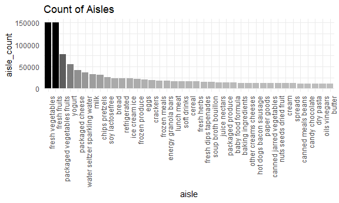

assignment3
================
Zheyan
10/12/2021

# Problem 1

The goal is to do some exploration of this dataset. To that end, write a
short description of the dataset, noting the size and structure of the
data, describing some key variables, and giving illstrative examples of
observations. Then, do or answer the following (commenting on the
results of each):

This dataset has 1384617 samples and 15 variables, and the key variables
are ‘order_number, ’order_dow’, ‘order_hour_of_day’, ‘product_name’,
‘aisle’ and ‘department’

## Q1

How many aisles are there, and which aisles are the most items ordered
from?

``` r
# count of aisles
aisles_cnt = 
  instacart %>% 
  select(aisle_id) %>% 
  n_distinct()

# Check that id and aisle name can match 1 by 1
max((instacart %>% 
  select(aisle_id, aisle) %>% 
  distinct() %>% 
  ungroup()) %>% 
  group_by(aisle_id) %>% 
  summarise(tmp = n()) %>% 
  pull(tmp))

aisles_count_df = 
  instacart %>% 
  group_by(aisle_id, aisle) %>% 
  summarise(aisle_count = n())
```

There are 134 aisles. **fresh vegetables** (ID: 83) has the most items,
which is 150609

## Q2

Make a plot that shows the number of items ordered in each aisle,
limiting this to aisles with more than 10000 items ordered. Arrange
aisles sensibly, and organize your plot so others can read it.

``` r
instacart %>%
  group_by(aisle) %>%
  summarise(
    aisle_count = n()
  ) %>%
  filter(aisle_count > 10000) %>%
  # arrange(aisle_count) %>% 
  # mutate(aisle = factor(aisle)) %>%
  mutate(aisle = reorder(aisle, -aisle_count)) %>% 
  ggplot() +
  geom_bar(aes(x = aisle, y = aisle_count, fill = aisle_count),stat="identity",show.legend = FALSE) +
  theme(axis.text.x = element_text(angle = 90, hjust = 1)) +
  labs(title = "Count of Aisles") +
  scale_fill_gradient(low = "grey", high = "black")
```


The top 3 aisles are packaged vegetables fruits, fresh fruits, fresh
vegetables.

## Q3

Make a table showing the three most popular items in each of the aisles
“baking ingredients”, “dog food care”, and “packaged vegetables fruits”.
Include the number of times each item is ordered in your table.

## Q4

Make a table showing the mean hour of the day at which Pink Lady Apples
and Coffee Ice Cream are ordered on each day of the week; format this
table for human readers (i.e. produce a 2 x 7 table)
