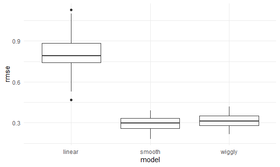

cross_validation
================
Zheyan
11/23/2021

# CV “by hand”

Generate a dataset

``` r
nonlin_df = 
  tibble(
    id = 1:100,
    x = runif(100, 0, 1),
    y = 1 - 10 * (x - .3) ^ 2 + rnorm(100, 0, .3)
  )

nonlin_df %>% 
  ggplot(aes(x = x, y = y)) + 
  geom_point()
```


Create spilits by hand; fit some models.

``` r
train_df = sample_n(nonlin_df, 80)
test_df = anti_join(nonlin_df, train_df, by = 'id')

ggplot(train_df, aes(x = x, y = y)) +
  geom_point() +
  geom_point(data = test_df, color = 'red')
```


Fit my models

``` r
linear_mod = lm(y ~ x, data = train_df)
smooth_mod = mgcv::gam(y ~ s(x), data = train_df)
wiggly_mod = mgcv::gam(y ~ s(x, k = 30), sp = 10e-6, data = train_df)
```

Plot the results

``` r
train_df %>% 
  add_predictions(smooth_mod) %>% 
  ggplot(aes(x = x, y = y)) + 
  geom_point() +
  geom_line(aes(y = pred))
```


Quantify the results

``` r
rmse(linear_mod, test_df)
```

    ## [1] 0.5866662

``` r
rmse(smooth_mod, test_df)
```

    ## [1] 0.3933241

``` r
rmse(wiggly_mod, test_df)
```

    ## [1] 0.3645101

## CV iteratively

Use `modelr::crossv_mc`

``` r
cv_df = 
  crossv_mc(nonlin_df, 100) %>% 
  mutate(
    train = map(train, as_tibble),
    test = map(test, as_tibble)
  )

cv_df
```

    ## # A tibble: 100 x 3
    ##    train             test              .id  
    ##    <list>            <list>            <chr>
    ##  1 <tibble [79 x 3]> <tibble [21 x 3]> 001  
    ##  2 <tibble [79 x 3]> <tibble [21 x 3]> 002  
    ##  3 <tibble [79 x 3]> <tibble [21 x 3]> 003  
    ##  4 <tibble [79 x 3]> <tibble [21 x 3]> 004  
    ##  5 <tibble [79 x 3]> <tibble [21 x 3]> 005  
    ##  6 <tibble [79 x 3]> <tibble [21 x 3]> 006  
    ##  7 <tibble [79 x 3]> <tibble [21 x 3]> 007  
    ##  8 <tibble [79 x 3]> <tibble [21 x 3]> 008  
    ##  9 <tibble [79 x 3]> <tibble [21 x 3]> 009  
    ## 10 <tibble [79 x 3]> <tibble [21 x 3]> 010  
    ## # ... with 90 more rows

``` r
# cv_df %>% 
#   pull(train) %>% .[[100]] %>% as_tibble()
```

Let’s fit some models

``` r
cv_df = 
  cv_df %>% 
  mutate(
    linear_mod  = map(train, ~lm(y ~ x, data = .x)),
    smooth_mod  = map(train, ~mgcv::gam(y ~ s(x), data = .x)),
    wiggly_mod  = map(train, ~gam(y ~ s(x, k = 30), sp = 10e-6, data = .x))) %>% 
  mutate(
    rmse_linear = map2_dbl(linear_mod, test, ~rmse(model = .x, data = .y)),
    rmse_smooth = map2_dbl(smooth_mod, test, ~rmse(model = .x, data = .y)),
    rmse_wiggly = map2_dbl(wiggly_mod, test, ~rmse(model = .x, data = .y)))
```

Look at output

``` r
cv_df %>% 
  select(starts_with('rmse')) %>% 
  pivot_longer(
    rmse_linear:rmse_wiggly,
    names_to = 'model',
    values_to = 'rmse',
    names_prefix = 'rmse_'
  ) %>% 
  ggplot(aes(x = model, y = rmse)) +
  geom_boxplot()
```


