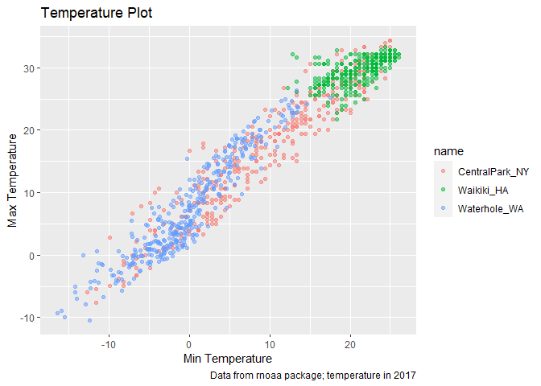
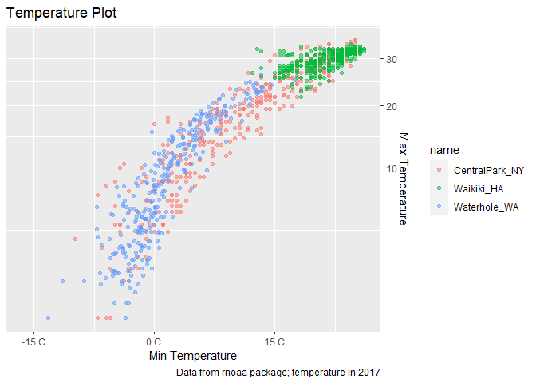
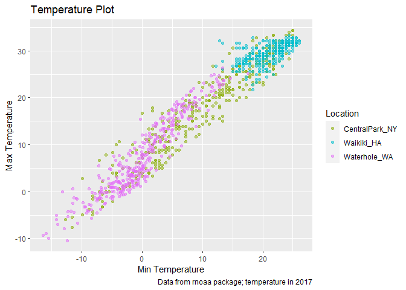
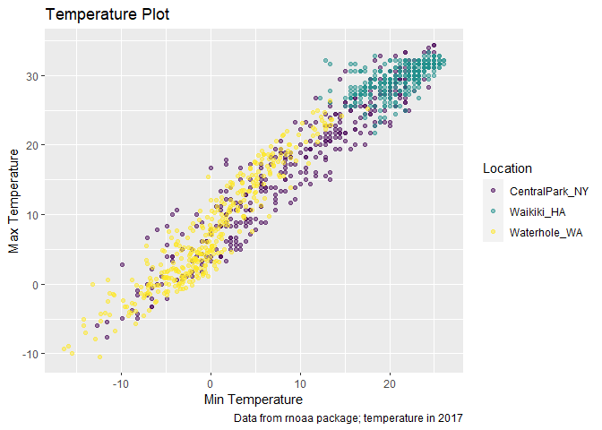
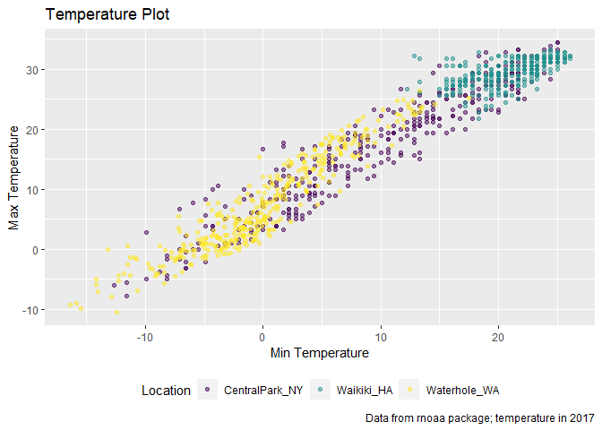
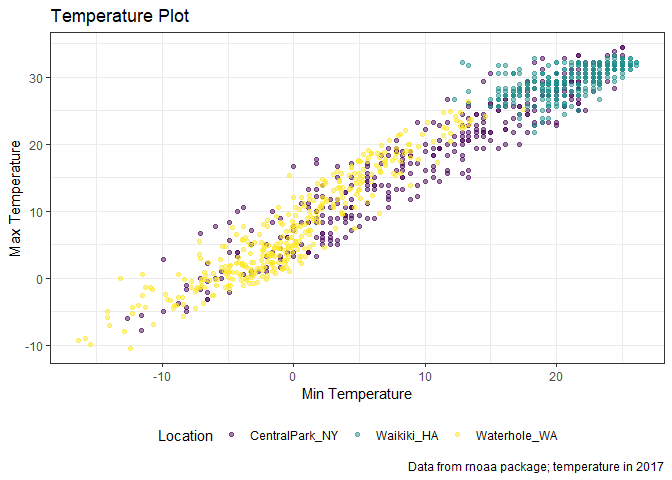
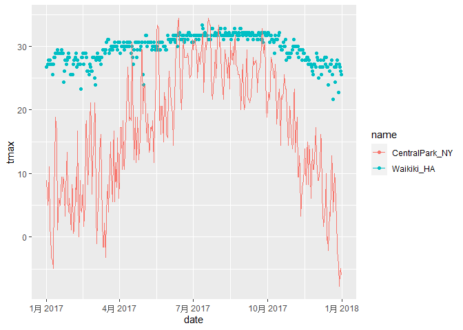

Visualization2
================
Zheyan
2021/10/11

# Weather data

``` r
weather_df = 
  rnoaa::meteo_pull_monitors(
    c("USW00094728", "USC00519397", "USS0023B17S"),
    var = c("PRCP", "TMIN", "TMAX"), 
    date_min = "2017-01-01",
    date_max = "2017-12-31") %>%
  mutate(
    name = recode(
      id, 
      USW00094728 = "CentralPark_NY", 
      USC00519397 = "Waikiki_HA",
      USS0023B17S = "Waterhole_WA"),
    tmin = tmin / 10,
    tmax = tmax / 10) %>%
  select(name, id, everything())
```

    ## Registered S3 method overwritten by 'hoardr':
    ##   method           from
    ##   print.cache_info httr

    ## using cached file: C:\Users\jimmy\AppData\Local/Cache/R/noaa_ghcnd/USW00094728.dly

    ## date created (size, mb): 2021-10-05 00:17:48 (7.617)

    ## file min/max dates: 1869-01-01 / 2021-10-31

    ## using cached file: C:\Users\jimmy\AppData\Local/Cache/R/noaa_ghcnd/USC00519397.dly

    ## date created (size, mb): 2021-10-05 00:18:00 (1.701)

    ## file min/max dates: 1965-01-01 / 2020-02-29

    ## using cached file: C:\Users\jimmy\AppData\Local/Cache/R/noaa_ghcnd/USS0023B17S.dly

    ## date created (size, mb): 2021-10-05 00:18:06 (0.913)

    ## file min/max dates: 1999-09-01 / 2021-09-30

``` r
head(weather_df)
```

    ## # A tibble: 6 x 6
    ##   name           id          date        prcp  tmax  tmin
    ##   <chr>          <chr>       <date>     <dbl> <dbl> <dbl>
    ## 1 CentralPark_NY USW00094728 2017-01-01     0   8.9   4.4
    ## 2 CentralPark_NY USW00094728 2017-01-02    53   5     2.8
    ## 3 CentralPark_NY USW00094728 2017-01-03   147   6.1   3.9
    ## 4 CentralPark_NY USW00094728 2017-01-04     0  11.1   1.1
    ## 5 CentralPark_NY USW00094728 2017-01-05     0   1.1  -2.7
    ## 6 CentralPark_NY USW00094728 2017-01-06    13   0.6  -3.8

# Lets plot!

## Label and title

``` r
weather_df %>% 
  ggplot(aes(x = tmin, y = tmax, color = name)) +
  geom_point(alpha = 0.5) +
  labs(
    title = 'Temperature Plot',
    x = 'Min Temperature',
    y = 'Max Temperature',
    caption = 'Data from rnoaa package; temperature in 2017'
  )
```

    ## Warning: Removed 15 rows containing missing values (geom_point).

<!-- -->

## Scales

``` r
weather_df %>% 
  ggplot(aes(x = tmin, y = tmax, color = name)) +
  geom_point(alpha = 0.5) +
  labs(
    title = 'Temperature Plot',
    x = 'Min Temperature',
    y = 'Max Temperature',
    caption = 'Data from rnoaa package; temperature in 2017'
  ) +
  scale_x_continuous(
    breaks = c(-15, 0, 15),
    labels = c('-15 C', '0 C', '15 C')
  ) +
  scale_y_continuous(
    trans = 'sqrt',
    position = 'right'
  )
```

    ## Warning in self$trans$transform(x): 产生了NaNs

    ## Warning: Transformation introduced infinite values in continuous y-axis

    ## Warning: Removed 90 rows containing missing values (geom_point).

<!-- -->

Look at color scales

``` r
weather_df %>% 
  ggplot(aes(x = tmin, y = tmax, color = name)) +
  geom_point(alpha = 0.5) +
  labs(
    title = 'Temperature Plot',
    x = 'Min Temperature',
    y = 'Max Temperature',
    caption = 'Data from rnoaa package; temperature in 2017'
  ) +
  scale_color_hue(
    name = 'Location',
    h = c(100,300)
  )
```

    ## Warning: Removed 15 rows containing missing values (geom_point).

<!-- -->

Also, we can do this with viridis package

``` r
weather_df %>% 
  ggplot(aes(x = tmin, y = tmax, color = name)) +
  geom_point(alpha = 0.5) +
  labs(
    title = 'Temperature Plot',
    x = 'Min Temperature',
    y = 'Max Temperature',
    caption = 'Data from rnoaa package; temperature in 2017'
  ) +
  viridis::scale_color_viridis(
    name = 'Location',
    discrete = TRUE)
```

    ## Warning: Removed 15 rows containing missing values (geom_point).

<!-- -->

## Themes

``` r
weather_df %>% 
  ggplot(aes(x = tmin, y = tmax, color = name)) +
  geom_point(alpha = 0.5) +
  labs(
    title = 'Temperature Plot',
    x = 'Min Temperature',
    y = 'Max Temperature',
    caption = 'Data from rnoaa package; temperature in 2017'
  ) +
  viridis::scale_color_viridis(
    name = 'Location',
    discrete = TRUE) +
  theme(legend.position = 'bottom')
```

    ## Warning: Removed 15 rows containing missing values (geom_point).

<!-- -->

Change the overall theme

``` r
weather_df %>% 
  ggplot(aes(x = tmin, y = tmax, color = name)) +
  geom_point(alpha = 0.5) +
  labs(
    title = 'Temperature Plot',
    x = 'Min Temperature',
    y = 'Max Temperature',
    caption = 'Data from rnoaa package; temperature in 2017'
  ) +
  viridis::scale_color_viridis(
    name = 'Location',
    discrete = TRUE) +
  # theme_minimal()
  theme_bw()+
  theme(legend.position = 'bottom')
```

    ## Warning: Removed 15 rows containing missing values (geom_point).

<!-- -->

## Setting options

``` r
library(tidyverse)

knitr::opts_chunk$set(
  fig.width = 6,
  fig.asp = .6,
  out.width = "90%"
)

theme_set(theme_minimal() + theme(legend.position = 'bottom'))

options(
  ggplot2.continuous.colour = 'viridis',
  ggplot2.continuous.fill = 'viridis'
)

scale_colour_discrete = scale_colour_viridis_d
scale_fill_discrete = scale_fill_viridis_d
```

## Data args in ‘geom’

``` r
central_park = 
  weather_df %>% 
  filter(name == 'CentralPark_NY')

waikiki = 
  weather_df %>% 
  filter(name == 'Waikiki_HA')

ggplot(data = waikiki, aes(x = date, y = tmax, color = name)) +
  geom_point()+
  geom_line(data = central_park)
```

    ## Warning: Removed 3 rows containing missing values (geom_point).

<!-- -->
